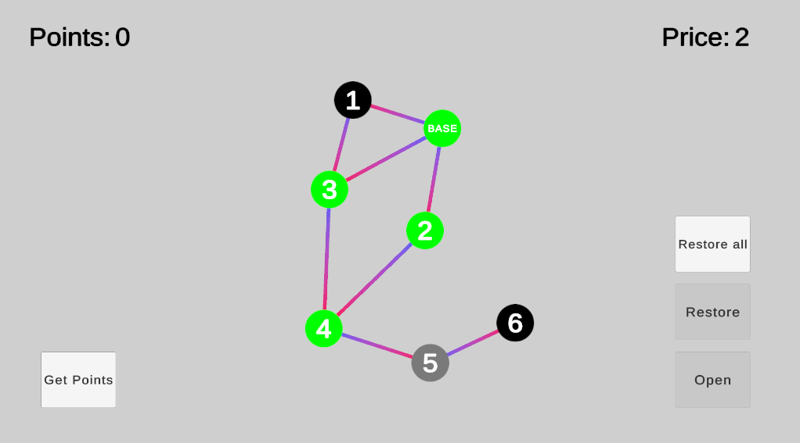

# RPG-Abilities

Пусть в нашей RPG-игре игрок может обладать некоторыми умениями. Для изучения умений игрок тратит очки, которые зарабатывает в процессе игры. Изучение каждого умения обходится игроку в одно или несколько очков.
Между умениями существуют ненаправленные связи. Изначально у игрока изучено только одно базовое умение. Все остальные умения могут быть изучены, только если выполнены оба условия: 

- у игрока есть достаточное количество очков;
- изучаемое умение связано хотя бы с одним уже изученным умением.
- 
Изученные умения можно забывать. Забытое умение снова становится неизученным, а игрок получает обратно потраченные на его изучение очки. Умение может быть забыто в том и только в том случае, если все оставшиеся изученные умения будут иметь связь (прямую или по цепочке) с базовым умением. Базовое умение забыть нельзя.

Для взаимодействия с игрой предполагается следующий интерфейс: 
- Индикатор количества очков у игрока. 
- Кнопка Заработать. При нажатии на нее игрок получает еще одно очко. 
- Схема с умениями, аналогичная первому рисунку. Умения обозначаются кружочками с номером и имеют два состояния: изучено/не изучено. 
- В каждый момент какое-то одно (и только одно) умение может быть выделено. Все остальные взаимодействия производятся с выделенным умением. 
- Индикатор стоимости выделенного умения. 
- Кнопка Изучить. Активна только если выделенную способность можно изучить. 
- Кнопка Забыть. Активна только если выделенную способность можно забыть. 
- Кнопка Забыть все. Активна всегда, сбрасывает все умения и возвращает все потраченные на изучение умений очки игроку

